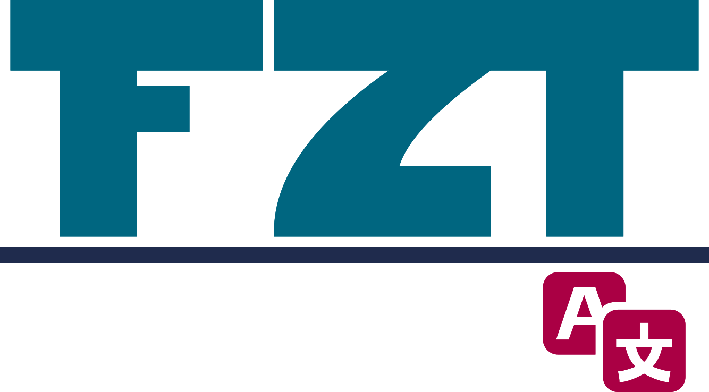

<p align="center">
   
</p>

<h1 align="center">
  FZ Translator<br>

  <p align='center'>
  <a href="https://www.codacy.com/gh/faouziMohamed/fz-nmt/dashboard?utm_source=github.com&amp;utm_medium=referral&amp;utm_content=faouziMohamed/fz-nmt&amp;utm_campaign=Badge_Grade">
    
  </a>
 <!-- <a href="LICENSE">
    
  </a> -->
  <a href="https://fz-nmt.vercel.app/">
    
  </a> 
 </p>
</h1>

<p align='right'>
  <a href="https://nextjs.org/" alt='GO to NextJs website'>
    
  </a>
</p>

:parasol_on_ground: Live Version https://fz-nmt.vercel.app/

## Getting Started

To run the project locally you'll need to have [**nodeJs**](https://nodejs.org/en/download/) > 10 installed in your machine.

First clone this repo :

```bash
# ssh-url
git clone git@github.com:faouziMohamed/fz-nmt.git
# Or the HTTPS url
git clone https://github.com/faouziMohamed/fz-nmt.git

cd fz-nmt
```

You'll need to install dependencies:

```bash
yarn install
# or
npm install
```

Then, run the development server:

```bash
yarn dev
# or
npm run dev
```

Open [http://localhost:3000](http://localhost:3000) with your browser to see the result.

## Contribution

To report issue or make a feature request please refer to this link [fz-nmt/issues](https://github.com/faouziMohamed/fz-nmt/issues)
To submit a pull request please refer to this link [fz-nmt/pulls](https://github.com/faouziMohamed/fz-nmt/pulls)

## Licence

This project is under [MIT license](LICENSE) copyright 2021
